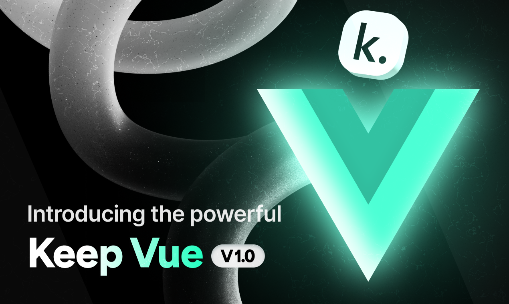

# Keep Vue

Keep Vue is an open-source component library built on Tailwind CSS and React.js. It provides a versatile set of pre-designed UI components that enable developers to streamline the creation of modern, responsive, and visually appealing web applications.



## Table of Contents

- [Keep Vue](#keep-vue)
  - [Table of Contents](#table-of-contents)
  - [Installation](#installation)
    - [Vue Application](#vue-application)
    - [Nuxt JS Application](#nuxt-js-application)
  - [usage](#usage)
  - [Components](#components)
  - [Contributing](#contributing)
  - [Figma](#figma)
  - [License](#license)

## Installation

## Vue Application

Setting Up Keep Vue in vue Application

`Step 1:` Create a vue Application

```console
npm create vite@latest my-project -- --template vue
cd my-project
```

`Step 2:` Install Tailwind CSS

```console
npm i autoprefixer postcss tailwindcss
npx tailwindcss init -p
```

`Step 3:` Install Keep Vue:

```console
npm i keep-vue @phosphor-icons/vue
```

Or with Yarn

```console
yarn add keep-vue @phosphor-icons/vue
```

Or with Pnpm

```console
pnpm add keep-vue @phosphor-icons/vue
```

`Step 4:` Go to the `tailwind.config.js` file and paste the
following code:

```tsx
import { keepTheme } from "keep-vue/keepTheme";

const config = {
  content: ["./index.html", "./src/**/*.{vue,js,ts,jsx,tsx}"],
  theme: {
    extend: {},
  },
  plugins: [],
};
export default keepTheme(config);
```

```tailwind.config.ts
import type { Config } from 'tailwindcss'

  import { keepTheme } from "keep-vue/keepTheme";
const config : Config = {
    content: ['./index.html', './src/**/*.{vue,js,ts,jsx,tsx}'],
    theme: {
      extend: {}
    },
    plugins: []
  }
export default keepTheme(config);
```

`Step 5:` Add Tailwind CSS to src/main.css File:

```css
@import "keep-vue/css";
@tailwind base;
@tailwind components;
@tailwind utilities;
```

Congratulations! You have successfully installed the Keep Vue on your nuxt application. Now you can import any component from keep-vue and use it in your project.

```tsx
 import { Button } from "keep-vue";
</script>

<template>
  <Button>Keep Vue</Button>
</template>
```

## Nuxt JS Application

You can easily integrate `keep-vue` into your Nuxt.js application.

`Step 1:` Install Nuxt JS Application

with npx

```console
npx nuxi@latest init <project-name>
```

Or with Yarn

```console
yarn dlx nuxi@latest init <project-name>
```

Or with pnpm

```console
pnpm dlx nuxi@latest init <project-name>
```

`Step 2:` Install Tailwind module for Nuxt

with npm

```console
npx nuxi@latest module add tailwindcss
npx tailwindcss init
```

Or with Yarn

```console
yarn add -D @nuxtjs/tailwindcss
npx tailwindcss init
```

if you use yarn for installing tailwind then you need to add the tailwind module in the `nuxt.config.js` file manually.

```tsx
  modules: [
  //rest modules...
 '@nuxtjs/tailwindcss'
  ],
```

`Step 3:` Install Keep Vue

with npm

```console
npm i keep-vue
npm install --save-dev nuxt-phosphor-icons
```

Or with yarn

```console
yarn add keep-vue
yarn add --dev nuxt-phosphor-icons
```

Or with pnpm

```console
pnpm add keep-vue
pnpm add -D nuxt-phosphor-icons
```

if you use yarn or pnpm for installing phosphor Icon then you need to add the `nuxt-phosphor-icons` module in the `nuxt.config.js` file manually.

```tsx
  modules: [
    "nuxt-phosphor-icons",
  ],
```

`Step 4:` Go to the `tailwind.config.js` file and paste the
following code

```js
import { keepTheme } from "keep-vue/keepTheme";
module.exports = keepTheme({
  content: [
    "./components/**/*.{js,vue,ts}",
    "./layouts/**/*.vue",
    "./pages/**/*.vue",
    "./plugins/**/*.{js,ts}",
    "./app.vue",
    "./error.vue",
  ],
  theme: {
    extend: {},
  },
  plugins: [],
});
```

```ts
import { keepTheme } from "keep-vue/keepTheme";
import type { Config } from "tailwindcss";

const config: Config = keepTheme({
  content: [
    "./components/**/*.{js,vue,ts}",
    "./layouts/**/*.vue",
    "./pages/**/*.vue",
    "./plugins/**/*.{js,ts}",
    "./app.vue",
    "./error.vue",
  ],
  theme: {
    extend: {},
  },
  plugins: [],
});
export default config;
```

`Step 5:` Create a style folder and then add Tailwind CSS to `main.css` File:

```css
@import "keep-vue/css";
@tailwind base;
@tailwind components;
@tailwind utilities;
```

Congratulations! You have successfully installed the Keep Vue on your nuxt application. Now you can import any component from keep-vue and use it in your project.

## usage

```jsx
import { Button } from "keep-vue";
</script>

<template>
  <Button>Keep Vue</Button>
</template>
```

## Components

The Keep Vue offers a wide range of components to build your user interfaces. For detailed usage and examples of each component, refer to our [component documentation](https://vue.keepdesign.io/docs/getting-started/introduction).

## Contributing

If you want to contribute to the Keep Vue, you can follow the [contributing guide](https://github.com/StaticMania/keep-vue/blob/main/Contribute.md).

## Contributors

This project exists thanks to all the people who contribute:

<a href="https://github.com/StaticMania/keep-vue/graphs/contributors">
  
</a>

## Figma

If you need access to Figma design files for the components, you can check out our website for more information:

[Get access to the Figma design files](https://keepdesign.io)

## License

The keep-vue name and logos are trademarks of StaticMania.

[Read about the licensing terms](https://github.com/StaticMania/keep-vue/blob/main/License)
